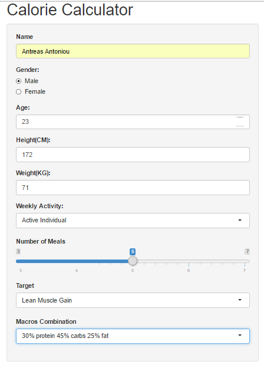
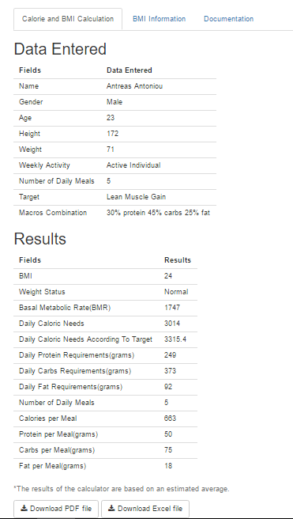

Calorie Calculator
========================================================
author: Antreas Antoniou

Body Mass Index
========================================================

With this calculator you can see your BMI and your weight status depending on that.
Your BMI is equal to $kg/m^2$ .

BMI Example


```
Height(CM): 180
```

```
Weight(KG): 72
```

```
BMI: 22
```

```
Weight Status: Normal
```
***
BMI Reference Table

|Category          |BMI Range - kg/(m^2) |
|:-----------------|:--------------------|
|Severe Thinness   |<16                  |
|Moderate Thinness |16-17                |
|Mild Thinness     |17-18.5              |
|Normal            |18.5-25              |
|Overweight        |25-30                |
|Obese Class I     |30-35                |
|Obese Class II    |35-40                |
|Obese Class III   |>40                  |

Calorie Calculation
===

#### **Weekly activity**

- 5 levels ranging from Low Intensity to Extremely Active Individual.
- Documentation Panel has information for these levels.

#### **Target**

- You can choose your target.
- Lean Muscle Gain or
- 3 Stages of Fat Loss (5%,10% or 15% calorie reduction ).

Calorie Calculation
===

### **Macros Combination**

- 5 combinations.
- For Female or low intensity individuals I suggest the first combination.
- For individuals serious about losing fat I suggest 40% or more protein.

### **Done**

- You have all the information you need about your calories and macros.
- You can save that information on a PDF or an Excel file.

Last Slide
===
title: false
### Entering Data



***

### Results


